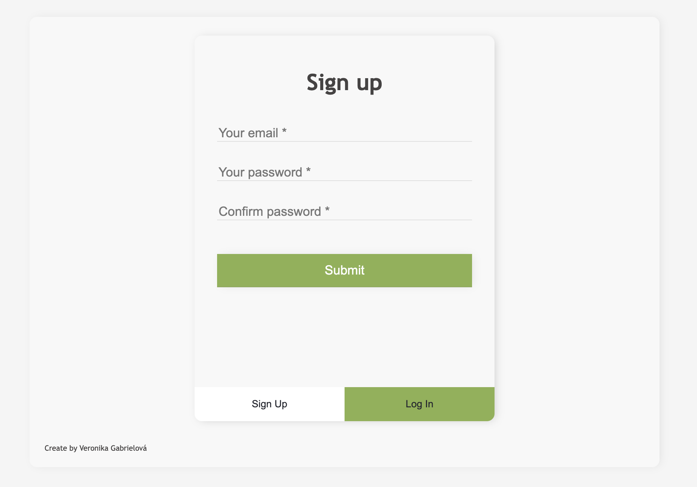
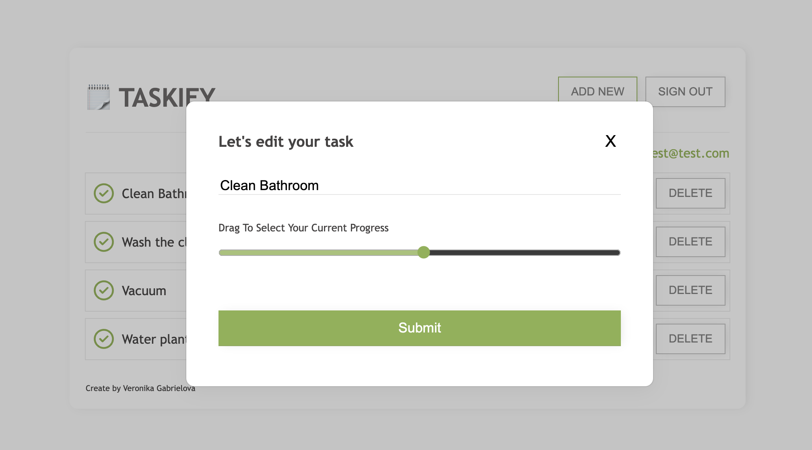
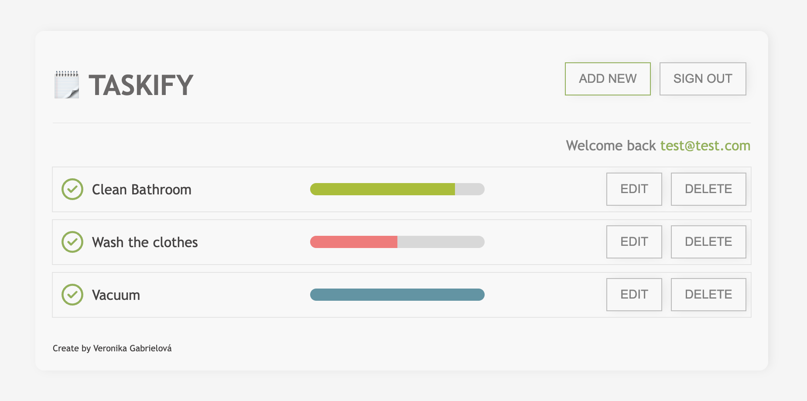

# TASKIFY!



Welcome to Taskify, my React project for task management and tracking progress. Taskify is an application that allows you to keep track of your tasks and monitor their progress. During the development of this project, I wanted to learn more about integrating databases, specifically PostgreSQL, into a project. This application served as a great opportunity for me to explore the connection between databases and web development.

Building Taskify was a significant challenge for me as it involved both the client-side (React) and server-side components. I gained valuable insights into how ports work and their impact on package dependencies and application functionality. I experimented with connecting databases to the server and learned about JSON syntax validators. Additionally, I discovered the importance of correctly formatting the `.env` file without any spaces around the equal signs.

Throughout the development process, I discovered and utilized several useful packages such as Express, CORS, bcrypt, jsonwebtoken, UUID, dotenv, Nodemon, and pg. These packages played a crucial role in enhancing the functionality and security of the application.




## Installation

To get started with Taskify, follow the steps below:

1. Clone the repository:

   ```terminal
   git clone https://github.com/your-username/taskify.git
   ```

2. Install the dependencies for the root project:

   ```terminal
   cd taskify
   npm install
   ```

3. Install the dependencies for the server:

   ```terminal
   cd server
   npm install
   ```

4. Install the dependencies for the client:

   ```terminal
   cd client
   npm install
   ```

5. Set up the environment variables:

   - Create a `.env` file in the `server` directory.
   - Add the necessary environment variables, such as the database connection details and secret keys.

6. Start the server:

   ```terminal
   cd server
   npm start
   ```

7. Start the client:

   ```terminal
   cd client
   npm start
   ```

   The client application will open in your default web browser.

## Technologies Used

- React
- Node.js
- Express
- PostgreSQL
- CORS
- bcrypt
- jsonwebtoken
- UUID
- dotenv
- Nodemon
- pg

## Contributing

Contributions are welcome! If you have any suggestions or find any issues, please feel free to submit a pull request or open an issue.

Thank you for checking out Taskify! If you have any questions or feedback, please don't hesitate to reach out. Happy task management!
